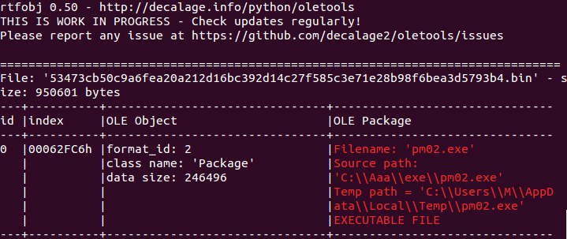

rtfobj
======

rtfobj is a Python module to detect and extract embedded objects stored
in RTF files, such as OLE objects. It can also detect OLE Package objects,
and extract the embedded files.

Since v0.50, rtfobj contains a custom RTF parser that has been designed to
match MS Word's behaviour, in order to handle obfuscated RTF files. See my
article ["Anti-Analysis Tricks in Weaponized RTF"](http://decalage.info/rtf_tricks)
for some concrete examples.

rtfobj can be used as a Python library or a command-line tool.

It is part of the [python-oletools](http://www.decalage.info/python/oletools) package.

## Usage

```text
rtfobj [options] <filename> [filename2 ...]

Options:
  -h, --help            show this help message and exit
  -r                    find files recursively in subdirectories.
  -z ZIP_PASSWORD, --zip=ZIP_PASSWORD
                        if the file is a zip archive, open first file from it,
                        using the provided password (requires Python 2.6+)
  -f ZIP_FNAME, --zipfname=ZIP_FNAME
                        if the file is a zip archive, file(s) to be opened
                        within the zip. Wildcards * and ? are supported.
                        (default:*)
  -l LOGLEVEL, --loglevel=LOGLEVEL
                        logging level debug/info/warning/error/critical
                        (default=warning)
  -s SAVE_OBJECT, --save=SAVE_OBJECT
                        Save the object corresponding to the provided number
                        to a file, for example "-s 2". Use "-s all" to save
                        all objects at once.
  -d OUTPUT_DIR         use specified directory to save output files.
```

rtfobj displays a list of the OLE and Package objects that have been detected,
with their attributes such as class and filename.

When an OLE Package object contains an executable file or script, it is
highlighted as such. For example:



To extract an object or file, use the option -s followed by the object number
as shown in the table.

Example:

```text
rtfobj -s 0
```

It extracts and decodes the corresponding object, and saves it as a file
named "object_xxxx.bin", xxxx being the location of the object in the RTF file.


## How to use rtfobj in Python applications

As of v0.50, the API has changed significantly and it is not final yet.
For now, see the class RtfObjectParser in the code.

### Deprecated API (still functional):

rtf_iter_objects(filename) is an iterator which yields a tuple
(index, orig_len, object) providing the index of each hexadecimal stream
in the RTF file, and the corresponding decoded object.

Example:

```python
from oletools import rtfobj
for index, orig_len, data in rtfobj.rtf_iter_objects("myfile.rtf"):
    print('found object size %d at index %08X' % (len(data), index))
```

--------------------------------------------------------------------------

python-oletools documentation
-----------------------------

- [[Home]]
- [[License]]
- [[Install]]
- [[Contribute]], Suggest Improvements or Report Issues
- Tools:
	- [[olebrowse]]
	- [[oleid]]
	- [[olemeta]]
	- [[oletimes]]
	- [[oledir]]
	- [[olemap]]
	- [[olevba]]
	- [[mraptor]]
	- [[pyxswf]]
	- [[oleobj]]
	- [[rtfobj]]
